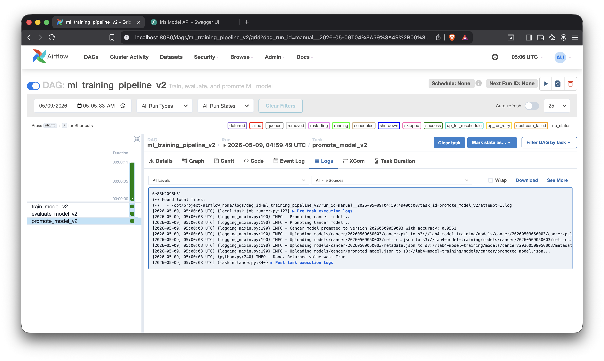
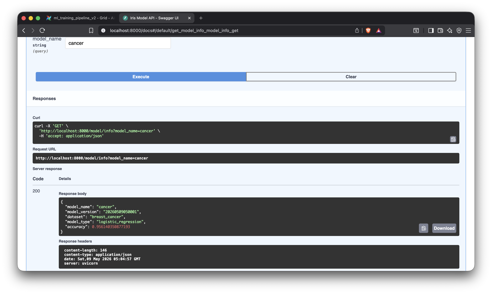
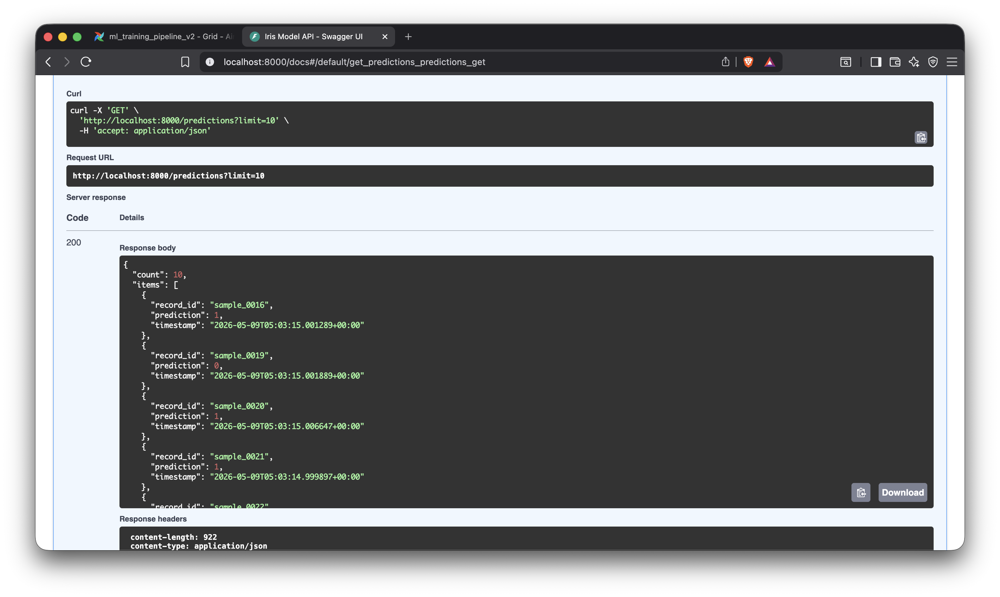

# Write Up

By Luca Comba and Pam Savira.

Source code available at: [https://github.com/lukfd/mlops_final](https://github.com/lukfd/mlops_final)

# Introduction

Building off of [https://github.com/lukfd/lab4_model_training](https://github.com/lukfd/lab4_model_training) we decided to add [Kubernetes in Docker](https://kind.sigs.k8s.io/) to allow us to have a SQS consumer to run inferences.

# Steps
This setup runs LocalStack, Airflow, FastAPI, and a nested Kind cluster inside Docker Compose. Airflow talks to the Kind API through a shared kubeconfig, and the consumers inside Kind reach LocalStack via a Kubernetes ExternalName service.

## Docker setup
1. Ensure Docker has at least 8 GB of RAM allocated.
2. Make the LocalStack init script executable (only once):

```bash
chmod +x scripts/localstack_init.sh
```

3. Build and start the stack:

```bash
docker compose up -d --build
```

4. Confirm the Kind cluster from Airflow:

```bash
make kind-get-nodes
```

Note: the Kind API server is pinned to port 6443 using the project `kind-config.yaml`. The provisioner rewrites the kubeconfig to `https://docker-host:6443` so Airflow can reach the nested cluster over the Compose network.

If `make kind-get-nodes` fails, verify the control-plane port mapping inside the DinD host:

```bash
docker compose exec -T docker-host docker ps
```

You should see the Kind control plane bound to `0.0.0.0:6443->6443/tcp`.

## Train
Run the cancer training pipeline in Airflow so it uploads the promoted model to S3 (LocalStack):

- Trigger the `ml_training_pipeline_v2` DAG in the Airflow UI.

This produces:
- `models/cancer/<version>/cancer.pkl`
- `models/cancer/<version>/metrics.json`
- `models/cancer/<version>/metadata.json`
- `models/cancer/promoted_model.json`

## SQS and consumer
1. Build the consumer image and load it into the Kind cluster:

```bash
make kind-build-consumer
make kind-load-consumer
## Or one shot:
## make kind-refresh-consumer
```

2. Apply the Kubernetes deployment:

```bash
make kind-apply-consumer
```

3. (Optional) Scale the consumer replicas:

```bash
make kind-scale-consumer
```

4. Trigger the `sqs_populate_inference_queue` DAG in Airflow. It loads the breast cancer test split and sends one message per record to SQS with `record_id` and `features`.

As the consumers poll SQS, they load the promoted model from S3 on startup, perform inference, and write each result to `s3://lab4-model-training/predictions/<record_id>.json`.

# Results

We successfully ran the entire pipeline locally, and we are sure that we can port these results into AWS or any other cloud provider.

Like described in the previous "Steps" section, we ran the `make up`. We then ran the `ml_training_pipeline_v2` DAG in Airflow.

Then we created all resources in Kubernetes.
```
@mlops_final $ make kind-build-consumer
docker compose -f docker-compose.yml exec -T docker-host \
                docker build -t inference-consumer:latest /opt/project/consumer
#0 building with "default" instance using docker driver

#1 [internal] load build definition from Dockerfile
#1 transferring dockerfile: 251B done
#1 DONE 0.0s

#2 [internal] load .dockerignore
#2 transferring context: 2B done
#2 DONE 0.0s

#3 [internal] load metadata for docker.io/library/python:3.11-slim
#3 DONE 1.0s

#4 [internal] load build context
#4 transferring context: 3.44kB done
#4 DONE 0.0s

#5 [1/5] FROM docker.io/library/python:3.11-slim@sha256:efde372d959bc3cb6848a31658b603877b91285b2970cae97221ee0c893d1f79

... truncated logs ...

@mlops_final $ make kind-apply-consumer
docker compose -f docker-compose.yml exec airflow-webserver \
                kubectl --kubeconfig /opt/project/kubeconfig.yaml apply -f /opt/project/k8s/deployment.yaml
deployment.apps/inference-consumer created
@mlops_final $ make kind-scale-consumer
docker compose -f docker-compose.yml exec airflow-webserver \
                kubectl --kubeconfig /opt/project/kubeconfig.yaml scale deployment inference-consumer --replicas=3
deployment.apps/inference-consumer scaled
```

We made sure that the kubernetes resources were up and running
```
@mlops_final $ docker compose exec airflow-webserver kubectl --kubeconfig /opt/project/kubeconfig.yaml get pods -n kube-system -l k8s-app=kube-dns
NAME                       READY   STATUS    RESTARTS   AGE
coredns-6f6b679f8f-ldz9s   1/1     Running   0          20m
coredns-6f6b679f8f-sv2pk   1/1     Running   0          20m
@mlops_final $ docker compose exec airflow-webserver kubectl --kubeconfig /opt/project/kubeconfig.yaml get svc localstack                                    
NAME         TYPE           CLUSTER-IP   EXTERNAL-IP                  PORT(S)   AGE
localstack   ExternalName   <none>       localstack.ai-pipeline-net   <none>    21m
```

Then we ran the `sqs_populate_inference_queue` DAG which kicked off the inferences by sending new messages to SQS so that the Kubernetes consumer could pick them up.

```bash
docker compose exec airflow-webserver kubectl --kubeconfig /opt/project/kubeconfig.yaml logs -l app=inference-consumer --tail=100
```

We then created a `GET /predictions` API endpoint to retrieve the predictions generated that were uploaded to S3.

```json
{
  "count": 10,
  "items": [
    {
      "record_id": "sample_0016",
      "prediction": 1,
      "timestamp": "2026-05-09T05:03:15.001289+00:00"
    },
    {
      "record_id": "sample_0019",
      "prediction": 0,
      "timestamp": "2026-05-09T05:03:15.001889+00:00"
    },
    {
      "record_id": "sample_0020",
      "prediction": 1,
      "timestamp": "2026-05-09T05:03:15.006647+00:00"
    },
    {
      "record_id": "sample_0021",
      "prediction": 1,
      "timestamp": "2026-05-09T05:03:14.999897+00:00"
    },
    {
      "record_id": "sample_0022",
      "prediction": 0,
      "timestamp": "2026-05-09T05:03:15.005760+00:00"
    },
    {
      "record_id": "sample_0023",
      "prediction": 1,
      "timestamp": "2026-05-09T05:03:15.009888+00:00"
    },
    {
      "record_id": "sample_0024",
      "prediction": 1,
      "timestamp": "2026-05-09T05:03:15.013844+00:00"
    },
    {
      "record_id": "sample_0025",
      "prediction": 1,
      "timestamp": "2026-05-09T05:03:15.007426+00:00"
    },
    {
      "record_id": "sample_0026",
      "prediction": 1,
      "timestamp": "2026-05-09T05:03:15.013892+00:00"
    },
    {
      "record_id": "sample_0027",
      "prediction": 1,
      "timestamp": "2026-05-09T05:03:15.019715+00:00"
    }
  ]
}
```







# Short Answers

1. **Describe your system end-to-end.**

As described before, the **training flow** uses the Airflow DAG `ml_training_pipeline_v2` which loads the breast cancer dataset, splits it into train/test sets, trains a logistic regression classifier, evaluates it and if a 0.94 accuracy threshold passes, the DAG promotes the model by uploading versioned artifacts (`cancer.pkl`, `metrics.json`, `metadata.json`) and a `promoted_model.json` pointer to S3, which in our case it is a LocalStack for mocking purposes. 

The **inference flow** uses a second Airflow DAG called `sqs_populate_inference_queue`. The DAG reads the same test split and sends one SQS message per record with a `record_id` and feature array. We have a running Kubernetes cluster deployed using KinD. One or more Kubernetes consumer pods poll the SQS queue, load the promoted model from S3 on startup, run `model.predict()` on each message, write the result as `predictions/<record_id>.json` to S3, and delete the message only after a successful write.

2. **Why is a queue used instead of direct API calls?**

Using a queue helps us decouple the producers from the inference consumers. The Airflow DAG can push all test records instantly without waiting for any inference to complete. This is a better approach so that if a failure for a single inference were to happen, it does not make the rest of the record fail as well. Consumers can be scaled depending on the incoming requests, and if they lag behind or crash, messages stay in the queue rather than being lost. Another advantage of using the queue is that it is an asynchronous call, while a direct API call would require the caller to wait for a synchronous response, block on consumer availability, and implement its own retry logic for failures.

3. **What happens if a consumer crashes mid-processing?**

When a consumer receives a message, SQS hides it from other consumers for that duration. If the consumer crashes before calling `delete_message`, the visibility timeout expires and the message reappears in the queue for another consumer to pick up. Because we only call `delete_message` after both the inference and the S3 write succeed, a mid-processing crash results in the message being retried without losing any record. If we configure an SQS Dead Letter Queue, messages that repeatedly fail can be moved there for manual inspection.

4. **Where are the bottlenecks in your system?**

The bottlenecks in the system are the write of the inference result to S3 (network round trips per record), and the cold-start time because each pod downloads the model at startup. A configured SQS Dead Letter Queue would help surface repeated failures for manual inspection.

5. **One improvement you would make for production.**

One thought we had was to improve the model promotion and use a model registry instead of having a `promoted_model.json` pointer. A registry would provide a central API for versioning, stage transitions, lineage tracking, and rollbacks.

Another improvement would be the implementation of a SQS Dead Letter Queue to make sure that failed inferences can be recovered and tracked down manually or implement a fallback pipeline.
