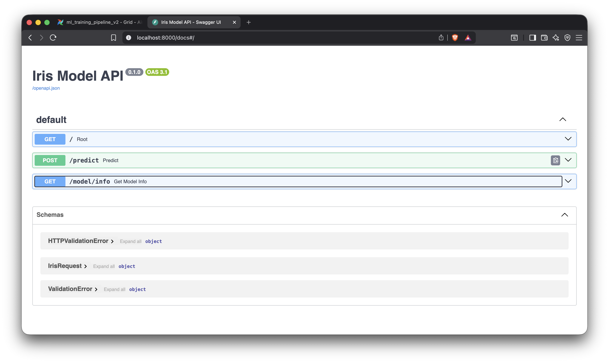
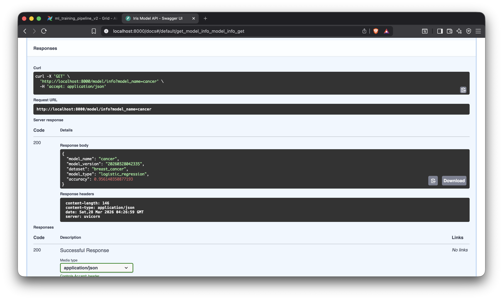

# Write Up

By Luca Comba and Pam Savira.

Source code available at: [https://github.com/lukfd/lab4_model_training](https://github.com/lukfd/lab4_model_training)

# Introduction

We developed the new training pipeline and implemented the new `model/info` endpoint.

We have started by containerize the deployment of Airflow using Docker, so we wrote the `Dockerfile.fastapi` file and the `docker-compose.yml` file. That helped us developing and quickly testing our new features.

We have also dockerized the FastAPI deployment and utilized the `localstack` docker image to mock AWS S3.

We aimed at creating a *Model Factory* to make it easy to implement new Machine Learning models and integrate it with the existing Airflow Dags and Tasks. To help us with that we designed the BaseModel class, which incorporates all the basic need and high level functions of a model, like a promotion mechanism.

With a new versioning system, the `model/info` API endpoint can now return information about the model in use and some extra information about it.

# Steps

## New Training Pipeline DAG

We wrote a new `ml_training_pipeline_v2.py` DAG which now accept a model name as a parameter so that it can train any type of model (Cancer or Iris, depending on the Model enum).

The DAG follows a three tasks: **train** which trains the selected model using the training set, **evaluate** that uses a test set and calculates a model metrics and finally **promote** if the evaluation metrics meet the threshold, promotes the model to S3 with versioning.

```python
with DAG(
    dag_id="ml_training_pipeline_v2",
    default_args=default_args,
    description="Train, evaluate, and promote ML model",
    schedule_interval=None,
    start_date=datetime(2025, 1, 1),
    catchup=False,
    params={
        "model_name": Param(
            Model.IRIS.value,
            enum=[model.value for model in Model],
            type="string",
        ),
    },
) as dag:
    # Runtime-selected model from Trigger DAG params.
    selected_model = "{{ params.model_name }}"

    train_result = train(model_name=selected_model)
    eval_result = evaluate(train_result=train_result)
    promote(eval_result=eval_result)
```

Now we have a single DAG for training, evaluate and promote multiple models.

## Better Dataset

For better modularity, we created a `BaseModel` class which can be inherited from other classes, like the new `CancerModel` and backported the `IrisModel`. This was a way to standardize all models and enable the use of a `ModelFactory`.

```python
class Model(Enum):
    IRIS = "iris"
    CANCER = "cancer"


class ModelFactory:
    @staticmethod
    def get_model_class(model: Model) -> Type[BaseModel]:
        if model == Model.IRIS:
            return IrisModel
        if model == Model.CANCER:
            return CancerModel
        raise ValueError(f"Unsupported model: {model}")

    @staticmethod
    def create_model(model: Model) -> BaseModel:
        return ModelFactory.get_model_class(model)()
```

This has allowed us to make the previously described `ml_training_pipeline_v2` DAG work with all models.

## Model Evaluation

The model evaluation is performed using the `evaluate()` method in each model class, so it depends on the specific rules dictated by the need of the model. For example both the Iris and Cancer models uses the `accuracy_score` to measure performance on the test set.

As requested the promotion of the model occurs only if the accuracy is greater than a threshold (default of 0.94). If the accuracy falls below this threshold, an `AirflowException` is raised and the pipeline stops.

## Model Versioning

To preserve all model versions and prevent overwriting, all models created are versioned in the format `YYYYMMDDhhmmss`.

The models, if promoted, are then uploaded to S3 using the Boto library. The S3 bucket is organized by model and version.

Each model might have a helper function `get_versioned_model_dir()` that returns the appropriately versioned.

## Model Promotion

Model promotion saves a promoted model to a versioned directory and uploads all artifacts to S3. The airflow promotion task then executes the promotion method of the model class that 

1. Creates a versioned directory at `models/{model_name}/{datetime_version}/`
2. Copies the trained model, metadata, and metrics to the versioned directory
3. Updates `models/{model_name}/promoted_model.json` with metadata pointing to the current version
4. Uploads all versioned artifacts to S3

This helps to keep all versions and have a pointer that points to the latest version.

## Model Info Endpoint

The FastAPI application exposes a `/model/info` endpoint that retrieves model metadata from S3 based on the `promoted_model.json`. The endpoint accepts an optional `model_name` query parameter to allow to get any model's metadata. The endpoint then retrieves the data from S3.

# Results

We were able to successfully trigger the airflow `ml_training_pipeline_v2.py` DAG, which ran the three tasks for training, evaluating and promoting the model. As shown in the picture, the airflow web UI showed a successful run which meant that a new "cancer" model was trained, evalutated and promoted.


In this writeup we cannot show the S3 bucket as we utilized a *localstack* Docker container, which mocks all AWS S3 functionality and stores the S3 Objects in memory. Therefore we are not able to take a screenshot of the objects uploaded by the promotion airflow task, but we are able to prove that it works as the `model/info` endpoint reads the metadata object from S3, and in our case the endpoint was able to return the correct data.

After the run of the DAG, the FastAPI application showed successfully the openapi.json page and the `model/info` endpoint correctly returned the metadata.json file as expected.





# Final Project Short Answers

1. **Describe your system end-to-end.**

   The system has two flows. In the **training flow**, an Airflow DAG (`ml_training_pipeline_v2`) loads the breast cancer dataset, splits it into train/test sets, trains a logistic regression classifier, evaluates it against a 0.94 accuracy threshold, and—if it passes—promotes the model by uploading versioned artifacts (`cancer.pkl`, `metrics.json`, `metadata.json`) and a `promoted_model.json` pointer to S3 (LocalStack). In the **inference flow**, a second Airflow DAG (`sqs_populate_inference_queue`) reads the same test split and sends one SQS message per record with a `record_id` and feature array. One or more Kubernetes consumer pods poll the SQS queue, load the promoted model from S3 on startup, run `model.predict()` on each message, write the result as `predictions/<record_id>.json` to S3, and delete the message only after a successful write.

2. **Why is a queue used instead of direct API calls?**

   A queue decouples producers from consumers. The Airflow DAG can finish pushing all 113 test records instantly without waiting for any inference to complete. Consumers process at their own pace, and if they lag behind or crash, messages stay in the queue rather than being lost. A direct API call would require the caller to wait for a synchronous response, block on consumer availability, and implement its own retry logic for failures.

3. **What happens if a consumer crashes mid-processing?**

   Each SQS message has a visibility timeout. When a consumer receives a message, SQS hides it from other consumers for that duration. If the consumer crashes before calling `delete_message`, the visibility timeout expires and the message reappears in the queue for another consumer to pick up. Because we only call `delete_message` after both the inference and the S3 write succeed, a mid-processing crash results in the message being retried—guaranteeing at-least-once delivery without losing any record.

4. **Where are the bottlenecks in your system?**

   The primary bottleneck is the consumer's sequential per-message processing loop: receive → predict → write to S3 → delete. S3 `put_object` adds network round-trip latency for every record. A secondary bottleneck is model loading: each consumer pod downloads the model from S3 once at startup, so cold-start time scales with model file size. The SQS queue itself is unlikely to be a bottleneck for this workload; the queue simply accumulates work that consumers drain at their own rate.

5. **One improvement you would make for production.**

   Replace the ad-hoc `promoted_model.json` pointer with a proper model registry (e.g., MLflow). A registry provides a central API for versioning, stage transitions (staging → production), lineage tracking, and rollback. It removes the fragile convention of hand-crafting JSON pointers in S3 and makes it safe to run multiple model types and versions simultaneously without path collisions.
